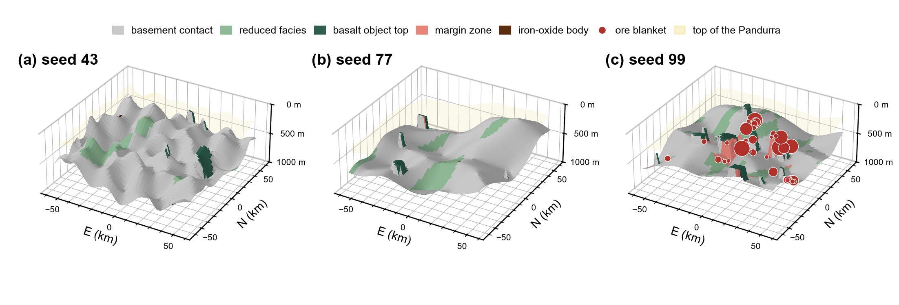
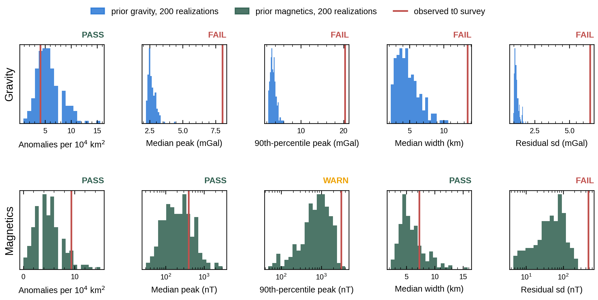

# SVOI_OD: a 1975 period prior for the Olympic Dam discovery

Prior models of the Stuart Shelf around Olympic Dam, South Australia, built only from what a geologist could know on **2 May 1975** (t0, the EL 190 grant). This repository holds the sediment-hosted copper branch of WP4 Annex A: the citation table that defines every parameter, the documents behind it, a sampler that turns the table into 3D realizations, and the checks the annex requires. It is part of the FleetSpace / Stanford Mineral-X SVOI project.



## Quick start

```bash
git clone https://github.com/Patrick-PengLi/SVOI_OD.git
cd SVOI_OD
pip install -r requirements.txt
jupyter lab wp4_period_prior_sediment_hosted.ipynb
```

Open the notebook with this folder as the working directory. Steps 0 to 14 run in about 1.5 minutes. Section 7 (Steps 15 to 18, 1,000 realizations) takes about 5 minutes more and is saved unexecuted; set `N_DELIV` in Step 16 for up to 10,000.

## Repository layout

| Folder | Contents |
|---|---|
| `wp4_period_prior_sediment_hosted.ipynb` | The notebook to run: sampler, level-by-level figures, Sections 4, 6 and 7 |
| `01_citation_table/` | `wp4_annexA_citation_table_draft.csv`, the 15 parameters of Annex A Section 5 (one row each, all confirmed 2026-09-22); `wp4_annexA_documentary_basis.csv`, the Section 6 register of named sources |
| `02_level_parameter_rows/` | Per-level verdict tables (L1 to L5) and parameter figures: the evidence behind each citation row |
| `03_sampler_inputs/` | Regional window, O'Driscoll's 1974 lineament targets, Mount Gunson dossier, Level 4 blanket statistics, Level 5 property table |
| `04_prior_predictive_observed/` | The t0 surveys, used only in the Section 4 check: 342 BMR gravity stations (1969) and the P234 aeromagnetic lines (1962, channel `mag_awagsLevelled`) |
| `05_rules/` | Annex A, the WP4 prior guideline, the level-by-level basis check |
| `06_sources/` | Every source document behind the table, by level, with transcriptions and `NOT_FOUND.md` notes; each level has a README |
| `07_notebooks/` | The five executed level notebooks and their figures (read-only records; they point at the project tree and do not re-run here) |
| `08_prior_models/` | Notebook outputs: figures `wp4_PP_00` to `wp4_PP_13`, draws and check tables, `wp4_sh_prior_sampler.py` (the sampler as a module) |

## What the notebook does

| Steps | Annex section | Content |
|---|---|---|
| 0 to 7 | 2, 3, 5 | Prior distributions; seeds 11, 23, 37 built level by level (frame, basalt, redox, ore, properties); 50-member check against the rows; 3D view |
| 8 to 13 | 4 | Prior predictive check: FFT forward operator (checked against SimPEG), 200 realizations against the t0 gravity and magnetics, PASS/WARN/FAIL gate |
| 14 | 6 | Audit of the documentary-basis register |
| 15 to 18 | 7 | Branch interface, weighted ensemble, local refinement to 250 m, version record |

Every number the sampler draws is checked against the text of its confirmed row before use (`cited()`). No gravity or magnetic observation informs a parameter (the annex's double-use rule); the surveys enter only in Section 4 and in the Section 7 weights.

## Model grid

GDA94 / MGA zone 53 (EPSG:28353). E 624,000 to 737,000 m, N 6,570,000 to 6,690,000 m (113 x 120 km). Cells 1 km horizontally; 80 layers of 25 m to 2,000 m, then 6 padding layers to 2,779 m; 1,166,160 cells. The ore blanket is thinner than a layer and is carried as disk objects, not voxels.

## Current results (v0.1, before rulings)



- **Rows:** basalt count, reduced fraction and basalt contrast agree with their rows; derived tonnage (median 19 Mt per patch) fills the gap between the Mount Gunson (0.15 to 3.2 Mt) and world-analog (57 to 198 Mt) clusters.
- **Section 4:** gross mismatch for gravity (observed anomalies about 3 to 4 times stronger and 3 times wider than any realization); near pass for magnetics.
- **Section 6:** all named sources accounted for; Haynes's memoranda, WMC's model sheets and the anomaly rankings are not in open file.
- **Section 7:** with survey noise only, the likelihood weights collapse onto one realization, as the Section 4 mismatch predicts.

## Fixed settings

Held constant, not sampled, and so without a citation row:

| Setting | Value | Source |
|---|---|---|
| Basement density, susceptibility | 2.60 g/cm3; 500 x 1e-6 cgs | Risely 1968; Dobrin 1960 |
| Basalt, basement resistivity | 3,100; 5,000 ohm-m | Dobrin 1960 |
| Basalt outline | aspect 1.3, azimuth 157 deg | Roopena outcrop, PORT AUGUSTA 1968 |
| Reduced belt | aspect 3.2, azimuth 10 deg | Mount Gunson corridor, Johns 1972 |
| Chalcopyrite | 34.6% Cu, 4.2 g/cm3 | Parasnis 1973 |
| Magnetization | induced only, April 1962 field (F 57,776 nT, I -62.44, D 6.00) | DGRF |
| Pandurra Formation | treated as cover | pending ruling |

Sampler choices without a source: trend amplitude equal to the 20% residual sd, uniform trend azimuth, cover floored at 50 m, reach d at least half a cell. Section 4 anomaly rule, fixed before the observed statistics: plane removed, 1 km grid, 3 or more cells above 2 mGal or 20 nT, noise 1.0 mGal and 5 nT.

## Reproducibility

One integer seed per realization (`numpy.random.default_rng(seed)`) reproduces it exactly, volumes included. Seeds 11, 23 and 37 are the figure models; 1000 to 1049 the row check; 1000 to 1199 the Section 4 ensemble; 1000 to 1999 the Section 7 ensemble. Step 18 writes `08_prior_models/wp4_prior_version.json` with the hashes of the citation table, register and sampler; downstream figures should quote its tag.

## Open items

1. Section 4 change: basement density variation (Level 5) or the 300 m basalt thickness cap (Level 2).
2. Fixed settings that carry no citation row.
3. Tonnage: derived as now, or drawn from the bimodal record.
4. Basalt placement: Johns 1974 puts at least 200 m of Pandurra over the basalt.
5. Likelihood design for the weights (WP3).
6. Standing of Haynes 2006 and Rutter and Esdale 1985; a request to BHP for the WMC memoranda and model sheets; Pandurra as cover or basement.

## Notes

- Paths inside the repo are kept under 140 characters (Windows limit); `06_sources/LONG_NAMES.csv` maps the shortened names to the originals. No file is over 50 MB.
- `06_sources/` contains third-party material: SARIG open-file reports and Geoscience Australia data (CC BY 4.0), USGS PP 820 (public domain), the Liege 1974 volume (open access), and copyrighted items kept for private cross-checking (scanned textbooks in `level5_petrophysical_attachment/era_textbooks/`, Economic Geology and SEG PDFs in the level 3 and 4 analog folders and `level2_basalt_objects/wmc_targeting_memoranda/`). **Keep this repository private**, or remove those items before making it public.
- Generated by `02_code/scripts/build_wp4_prior_state_folder.py` in the SVOI project tree; edit the project copies, not the files here.
