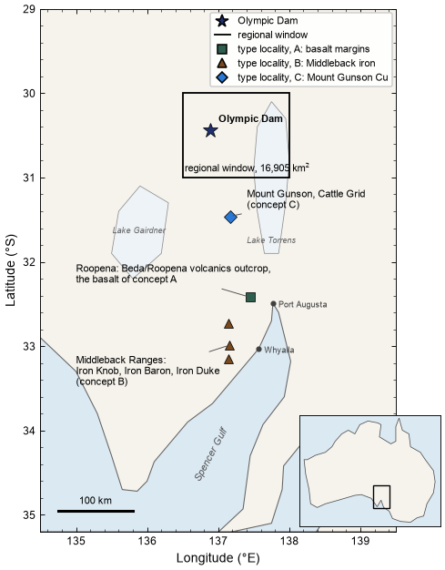
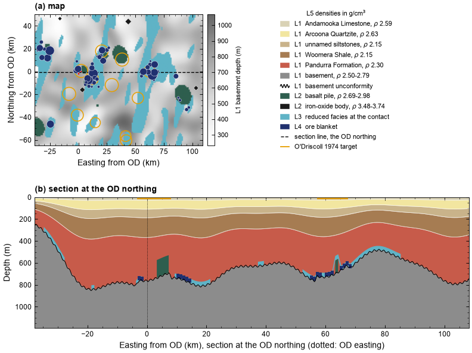
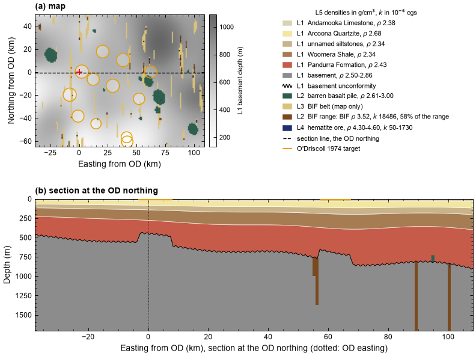
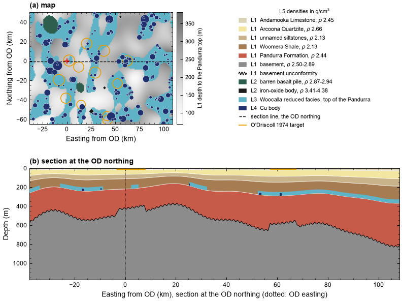
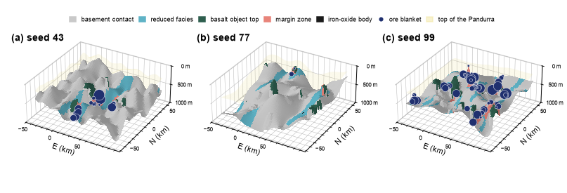
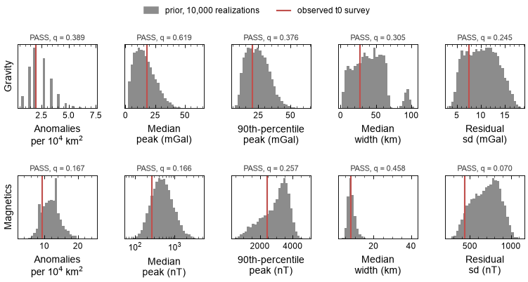
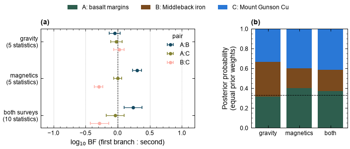

# SVOI_OD: a 1975 period prior for the Olympic Dam discovery

Prior models of the Stuart Shelf around Olympic Dam, South Australia, built only from what a geologist could know on **2 May 1975** (t0, the grant of EL 190). Every parameter traces to a document dated before t0 (the citation gate); the sampler turns the citation tables into 3D realizations; the t0 gravity and magnetic surveys are used only to check the prior, never to set it. Part of the FleetSpace / Stanford Mineral-X SVOI project.

<p align="center"></p>

## Three hypotheses, one setting

All three share the same stage (Level 1 cover and basement relief, barren basalt piles, Level 5 properties) and differ in Levels 2 to 4: what donates the metal, what traps it, where the ore forms.

| | Hypothesis | Reference in 1975 |
|---|---|---|
| **H1** (A) | The basalt piles are the copper donor, reduced facies at the basement contact are the trap, and ore forms as blankets in the margin zone beside the piles. | No mine in South Australia; a basalt-sourced stratiform copper model after White Pine (Michigan), with the Zambian Copperbelt and Kupferschiefer as the deposit class, and the Roopena basalt outcrop as the local donor rock. |
| **H2** (B) | Banded iron formation in the basement is the source, enrichment along the BIF ranges is the process, and ore forms as hematite bodies within the ranges; there is no copper system. | Iron Knob and Iron Baron, BHP's Middleback Ranges mines, worked since 1900. |
| **H3** (C) | The Pandurra red beds are the copper donor, reduced Woocalla facies in basement depressions are the trap, and ore forms as thin chalcocite bodies on top of the Pandurra, above a barren basement. | Mount Gunson, where the Cattle Grid open pit opened in 1974 on the 1971 discovery. |

**H1, sediment-hosted Cu on altered basalt margins** (`wp4_period_prior_sediment_hosted.ipynb`, Annex A)



**H2, Middleback-type iron** (`wp4_period_prior_middleback.ipynb`, Annex B)



**H3, Mount Gunson-type stratiform Cu** (`wp4_period_prior_mountgunson.ipynb`, Annex C)



Three H1 realizations in 3D (seeds 43, 77, 99):



## What the surveys say

Each prior is checked against the 1969 BMR helicopter gravity (398 stations) and the 1962 P234 aeromagnetics (37,095 readings) in two ways: a gate on five window statistics per survey (anomaly count, median and 90th-percentile peak, median width, residual sd; PASS if the observed value sits between the 5th and 95th percentile of the prior), and a falsification test by robust Mahalanobis distance on the data themselves. All three branches pass the gate and none is falsified: the surveys see the shared setting, and of the branch-specific objects only the BIF ranges.



At district scale the Bayes factors between the branches (`wp4_bayes_factor_branches.ipynb`, 10,000 members each) are weak: the magnetics disfavour H2 by about 2:1, and H1 and H3 are indistinguishable by construction. The branches are separated by what a drill hole intersects, not by the surveys.



## Quick start

```bash
git clone https://github.com/Patrick-PengLi/SVOI_OD.git
cd SVOI_OD
pip install -r requirements.txt
jupyter lab wp4_period_prior_sediment_hosted.ipynb
```

Run from this folder. Each prior notebook is self-contained at 200 members (about an hour on first run for the forward models, cached afterwards). The Annex B and C notebooks import the shared setting from `09_sherlock/svoi_core.py`.

The 10,000-member ensembles (seeds 3000 to 12999, identical across branches, 1.4 GB per branch) are published as the GitHub release [`ensembles-2026-10-07`](https://github.com/Patrick-PengLi/SVOI_OD/releases/tag/ensembles-2026-10-07) and are placed by

```bash
bash 10_releases/fetch_ensembles.sh      # needs the GitHub CLI; verifies SHA256 and fills 08_prior_models/**/gen_n10000/
```

They are read by `wp4_prior_ensemble_n10000_analysis*.ipynb` (one per branch) and `wp4_bayes_factor_branches.ipynb`, and regenerated on Sherlock from the `09_sherlock*` folders.

## Layout

| | |
|---|---|
| `wp4_period_prior_*.ipynb` | the three prior notebooks: sampler, level-by-level figures, gate, falsification, version record |
| `wp4_prior_ensemble_n10000_analysis*.ipynb` | the 10,000-member analysis per branch |
| `wp4_bayes_factor_branches.ipynb` | district-scale comparison of the three branches |
| `01_citation_table/` | the Annex A, B and C citation tables (every sampled parameter and its pre-t0 source) and the documentary register |
| `02_level_parameter_rows/`, `07_notebooks/` | the level-by-level evidence behind the Annex A rows |
| `03_sampler_inputs/` | regional window, O'Driscoll 1974 lineament targets, Mount Gunson dossier, blanket statistics, era property table |
| `04_prior_predictive_observed/` | the t0 surveys |
| `05_rules/` | Annex A, the WP4 prior guideline, the basis check |
| `06_sources/` | the source documents, by level, with transcriptions |
| `08_prior_models/` | notebook outputs: draws, gate and falsification tables, version records; `**/gen_n10000/` holds the ensembles once fetched |
| `09_sherlock*/` | the Sherlock generators (`svoi_core.py`, `svoi_fe.py`, `svoi_mg.py`, SLURM scripts) |
| `10_releases/` | release notes, checksums, `fetch_ensembles.sh` |
| `docs/figures/` | the figures shown here |

## Model grid and reproducibility

GDA94 / MGA zone 53. The Andamooka SH53-12 sheet, 147 x 115 km in 1 km cells; 80 layers of 25 m to 2 km, then 10 padding layers to about 6.3 km (1,520,550 cells). One integer seed reproduces a realization exactly (`numpy.random.default_rng(seed)`); the same seed gives the same Level 1 and piles in every branch. Each notebook's last step writes a version record with the hashes of its citation table and sampler.

## Notes

- `06_sources/` contains third-party material: SARIG open-file reports and Geoscience Australia data (CC BY 4.0), USGS PP 820 (public domain), the Liege 1974 volume (open access), and copyrighted items kept for private cross-checking (scanned textbooks in `level5_petrophysical_attachment/era_textbooks/`, Economic Geology and SEG PDFs in the level 3 and 4 analog folders). **Keep this repository private**, or remove those items before making it public.
- Paths are kept under 140 characters; `06_sources/LONG_NAMES.csv` maps shortened names to the originals.
