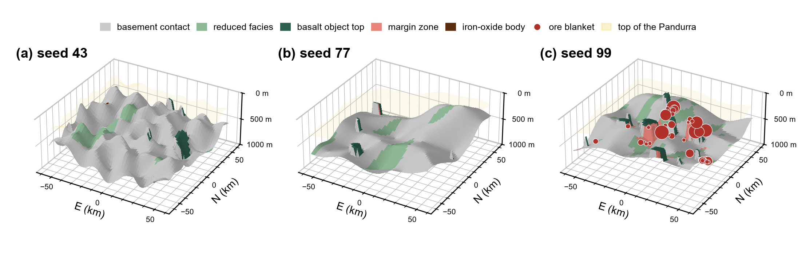
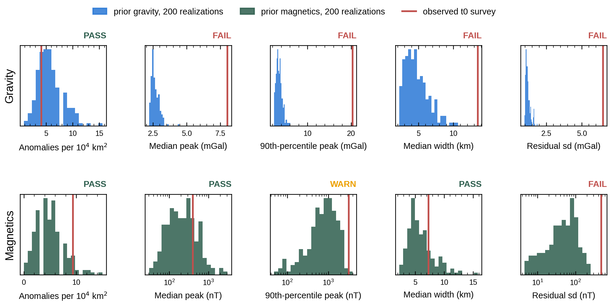

# SVOI_OD: a 1975 period prior for the Olympic Dam discovery

Prior models of the Stuart Shelf around Olympic Dam, South Australia, built only from what a geologist could know on **2 May 1975** (t0, the EL 190 grant). This repository holds the sediment-hosted copper branch of WP4 Annex A: the citation table that defines every parameter, the documents behind it, a sampler that turns the table into 3D realizations, and the checks the annex requires. It is part of the FleetSpace / Stanford Mineral-X SVOI project.



## Quick start

```bash
git clone https://github.com/Patrick-PengLi/SVOI_OD.git
cd SVOI_OD
pip install -r requirements.txt
jupyter lab wp4_period_prior_sediment_hosted.ipynb
```

Open the notebook with this folder as the working directory. Part 0 (Steps R1 and R2, cached after the first run) and Steps 0 to 15 run in about 3 minutes. Section 7 (Steps 16 to 19, 1,000 realizations) takes about 8 minutes more and is saved unexecuted; set `N_DELIV` in Step 17 for up to 10,000.

## Repository layout

| Folder | Contents |
|---|---|
| `wp4_period_prior_sediment_hosted.ipynb` | The notebook to run: sampler, level-by-level figures, Sections 4, 6 and 7 |
| `01_citation_table/` | `wp4_annexA_citation_table_draft.csv`, the 15 parameters of Annex A Section 5 plus the Change 1 and Change 2 rows, bundled as the annex bundles related draws (17 rows, 22 sampled quantities, all confirmed); `wp4_annexA_documentary_basis.csv`, the Section 6 register of named sources |
| `02_level_parameter_rows/` | Per-level verdict tables (L1 to L5) and parameter figures: the evidence behind each citation row |
| `03_sampler_inputs/` | Regional window, O'Driscoll's 1974 lineament targets, Mount Gunson dossier, Level 4 blanket statistics, Level 5 property table |
| `04_prior_predictive_observed/` | The t0 surveys, used only in the Section 4 check: the complete 1969 BMR helicopter gravity surveys 196953 and 196955 (the window selects 398 stations on the Andamooka sheet) and the P234 aeromagnetic lines (1962, channel `mag_awagsLevelled`) |
| `05_rules/` | Annex A, the WP4 prior guideline, the level-by-level basis check |
| `06_sources/` | Every source document behind the table, by level, with transcriptions and `NOT_FOUND.md` notes; each level has a README. `iron_oxide_bodies_middleback/` holds the seven pre-1975 Middleback / Iron Knob reports behind Change 1 |
| `07_notebooks/` | The five executed level notebooks and their figures (read-only records; they point at the project tree and do not re-run here) |
| `08_prior_models/` | Notebook outputs: figures `wp4_PP_R1`, `wp4_PP_R2`, `wp4_PP_R2a` (Part 0) and `wp4_PP_00` to `wp4_PP_14`, draws and check tables, `resolution/` (Part 0 caches and tables), `wp4_sh_prior_sampler.py` (the sampler as a module) |
| `09_sherlock/`, `09_sherlock_middleback/`, `09_sherlock_mountgunson/` | The 10,000-member generators for Sherlock (SLURM arrays): `svoi_core.py` is the shared setting built from the basalt notebook by `build_core.py` and is imported by the Annex B and C notebooks; `svoi_fe.py` and `svoi_mg.py` add the branch stages; `run_gen.py`, `merge_gen.py`, `gen_array.sbatch`, README in each |
| `10_releases/` | Release notes, checksums and `fetch_ensembles.sh` for the 10,000-member ensembles, which are too large for git and are published as a GitHub release (below) |

## The three branches and the 10,000-member ensembles

The repository now holds three concept branches on one shared setting (Level 1 frame, barren piles, Level 5 properties):

| | Notebook | Concept | Ensemble analysis |
|---|---|---|---|
| A | `wp4_period_prior_sediment_hosted.ipynb` | sediment-hosted Cu on altered basalt margins (Haynes), Annex A | `wp4_prior_ensemble_n10000_analysis.ipynb` |
| B | `wp4_period_prior_middleback.ipynb` | Middleback-type iron: BIF ranges, belt, hematite bodies, Annex B | `wp4_prior_ensemble_n10000_analysis_middleback.ipynb` |
| C | `wp4_period_prior_mountgunson.ipynb` | Mount Gunson-type stratiform Cu on the Pandurra top, Annex C | `wp4_prior_ensemble_n10000_analysis_mountgunson.ipynb` |

`wp4_bayes_factor_branches.ipynb` compares the three on the t0 surveys at district scale (synthetic likelihood on the Section 4 window statistics, acceptance-ratio check, equal prior weights).

The prior notebooks are self-contained at 200 members. The 10,000-member ensembles (seeds 3000 to 12999, identical across branches; about 1.4 GB per branch) are not in git. They are published as the GitHub release `ensembles-2026-10-07` and placed by

```bash
bash 10_releases/fetch_ensembles.sh        # needs the GitHub CLI; verifies SHA256 and fills 08_prior_models/**/gen_n10000/
```

or regenerated on Sherlock from the `09_sherlock*` folders (`README.md` in each). The analysis and Bayes-factor notebooks read them from `08_prior_models/gen_n10000/`, `08_prior_models/middleback/gen_n10000/` and `08_prior_models/mountgunson/gen_n10000/`.

## What the notebook does

| Steps | Annex section | Content |
|---|---|---|
| R1, R2 | (Part 0) | What the t0 surveys can resolve, from their geometry and noise: sampling and coverage; detection probability against anomaly amplitude and width (ideal detector and the anomaly rule), with the observed median peak as a reference line. The anomaly rule, the map grid and the forward operator are fixed here, before the prior |
| 0 to 7 | 2, 3, 5 | Prior distributions; seeds 43, 77, 99 built level by level (frame, basalt, redox, ore, properties); 50-member check against the rows; 3D view |
| 8 to 14 | 4 | Prior predictive check: FFT forward operator (checked against SimPEG), 200 realizations against the t0 gravity and magnetics, PASS/WARN/FAIL gate, observed and simulated profiles |
| 15 | 6 | Audit of the documentary-basis register |
| 16 to 19 | 7 | Branch interface, weighted ensemble, local refinement to 250 m, version record |

Every number the sampler draws is checked against the text of its confirmed row before use (`cited()`). No gravity or magnetic observation informs a parameter (the annex's double-use rule); the surveys enter only in Section 4 and in the Section 7 weights.

## Model grid

GDA94 / MGA zone 53 (EPSG:28353). E 624,000 to 737,000 m, N 6,570,000 to 6,690,000 m (113 x 120 km). Cells 1 km horizontally; 80 layers of 25 m to 2,000 m, then 10 padding layers to 6,250 m; 1,220,400 cells. The ore blanket is thinner than a layer and is carried as disk objects, not voxels; iron-oxide bodies smaller than a cell are carried with their contrasts scaled by the fraction of the cell they fill.

## Current results (v0.7, after Changes 1 to 6 and the L5-1 erratum)



- **Rows:** basalt count, reduced fraction and basalt contrast agree with their rows; derived tonnage (median 19 Mt per patch) fills the gap between the Mount Gunson (0.15 to 3.2 Mt) and world-analog (57 to 198 Mt) clusters.
- **Section 4:** version 0.1 (uniform basement) failed gravity on four of five statistics. Change 1 (2026-09-23) added a basement density field and Middleback-type iron-oxide bodies, both from pre-1975 sources and planned in WP4 Task 3 before the check. After the re-run, gravity passes all five statistics (observed quantiles 0.10 to 0.77). The basalt susceptibility row L5-1 was then corrected for a unit error (Parasnis Table I is in rationalised units; 250 to 105,000 read as cgs was 4 pi too high; now 20 to 26,000 x 1e-6 cgs). Change 2 then gave the basement its own susceptibility field (L5-6, from the same tables). Change 3 set that field's patch size to 16 km after a sensitivity set (4, 8, 16 km and two-scale cases; `08_prior_models/wp4_sens_basement_patch.csv`), a fixed setting chosen with the count statistic in view. Change 4 set that field's median to 1,120 x 1e-6 cgs (Grant and West 1965 Table 12-3, rhyolite mean, as the Gawler Range Volcanics analog) after the profiles at the old median of 500 showed the prior's magnetic variance sitting in rare spikes and a trial at 2,700 (Dobrin Table 13-2) proved twice too strong. Change 5 then gave both basement fields two scales, 30 km domains plus 4 km texture with 80% of the variance at the domain scale (scales from the era maps, share declared and chosen with the count in view), replacing the single patch sizes. Magnetics now passes median peak, 90th-percentile peak, width and residual sd, with the bulk character of the survey, and warns on the count (about twice the survey's, because the survey's broad high merges its small features). Version 0.5 (single 16 km patches) had the reverse miss, width; the sensitivity set records both. Change 6 (2026-09-23) returned the table to the annex's shape: L1-1 is one draw, the total cover to basement, Uniform(320, 670) m from the cited bores (the annex's [CHECK] placeholder 150 to 600 m replaced by the bounds found: Tent Hill plus Pandurra minima, and LY 2 which ended in Pandurra at 667 m), the unit thicknesses fixed shares of it; and the Change 1 and 2 rows were bundled into two (iron-oxide body size; density, basement density; susceptibility variation). Basement is about half as deep as before; every seed changed (reference draws v2). Gate v0.7: gravity passes all five (quantiles 0.18 to 0.80); magnetics passes the two peaks, width and residual sd and warns on the count (prior median 18.7 per 10,000 km2 against 9.4 observed, quantile 0.005).
- **Section 6:** all named sources accounted for; Haynes's memoranda, WMC's model sheets and the anomaly rankings are not in open file.
- **Section 7:** run locally; with survey noise only the weights are expected to collapse onto few realizations (a point-wise likelihood on 25,000 readings).

## Fixed settings

Held constant, not sampled, and so without a citation row:

| Setting | Value | Source |
|---|---|---|
| Basalt, basement resistivity | 3,100; 5,000 ohm-m | Dobrin 1960 |
| Basalt outline | aspect 1.3, azimuth 157 deg | Roopena outcrop, PORT AUGUSTA 1968 |
| Reduced belt | aspect 3.2, azimuth 10 deg | Mount Gunson corridor, Johns 1972 |
| Chalcopyrite | 34.6% Cu, 4.2 g/cm3 | Parasnis 1973 |
| Magnetization | induced only, April 1962 field (F 57,776 nT, I -62.44, D 6.00) | DGRF |
| Pandurra Formation | treated as cover | pending ruling |
| Cover unit shares (Change 6) | Stuart Shelf succession 0.46 of the total cover to basement, Pandurra 0.54 (midpoints of the per-unit ranges of versions 0.1 to 0.6); within the succession limestone 0.075, then quartzite 0.24, siltstones 0.23, shale 0.53 of the rest | Bulletin 41 pp. 29-30; Woomera No. 1; declared |
| Iron-oxide bodies (Change 1) | count 0.375 x basalt count; aspect 3, strike north-south; vertical extent 200 m from the unconformity; susceptibility 5,000 x 1e-6 cgs; no copper | Task 3 weights 0.15 : 0.40; RB 33/00090; Bull 009; RB 26/00103 |
| Basement density field (Changes 1 and 5) | mean 2.65 g/cm3, limits 2.50 to 3.12; two scales, 30 km domains plus 4 km texture, 80% of the variance at the domain scale; constant with depth | Dobrin 1960; Parasnis 1973; Risely 1968; domain sizes from the 1:250,000 sheets and Bulletin 41, share declared |
| Basement susceptibility field (Changes 2, 4 and 5) | log-normal, median 1,120 x 1e-6 cgs (Change 4, rhyolite mean), limits 10 to 20,000; the same two-scale geometry as the density field; independent of density; constant with depth | Dobrin 1960; Grant and West 1965; Parasnis 1973 |

Sampler choices without a source: trend amplitude equal to the 20% residual sd, uniform trend azimuth, cover floored at 50 m, reach d at least half a cell. Section 4 anomaly rule, fixed before the observed statistics: plane removed, 1 km grid, 3 or more cells above 2 mGal or 20 nT, noise 1.0 mGal and 5 nT.

## Reproducibility

One integer seed per realization (`numpy.random.default_rng(seed)`) reproduces it exactly, volumes included. Seeds 43, 77 and 99 are the figure models (11, 23 and 37 until version 0.7; changed after Change 6 so that the figures show basalt piles, an illustration choice); every section drawn is the Olympic Dam northing; 1000 to 1049 the row check; 1000 to 1199 the Section 4 ensemble; 1000 to 1999 the Section 7 ensemble. Step 18 writes `08_prior_models/wp4_prior_version.json` with the hashes of the citation table, register and sampler; downstream figures should quote its tag.

## Open items

1. The upper bound of L1-1 (670 m) is the deepest pre-t0 hole, LY 2, which did not reach basement; the true maximum is deeper and the gate's sensitivity to the bound is to be reported. The unit shares are declared.
2. The two-scale basement geometry (30 km, 4 km, 80% share) is a declared setting; the share has no source and was chosen with the count statistic in view. Count and width trade against each other; this version favours the width (the target scale).
3. Fixed settings that carry no citation row.
4. Tonnage: derived as now, or drawn from the bimodal record.
5. Basalt placement: Johns 1974 puts at least 200 m of Pandurra over the basalt.
6. Likelihood design for the weights (WP3).
7. Standing of Haynes 2006 and Rutter and Esdale 1985; a request to BHP for the WMC memoranda and model sheets; Pandurra as cover or basement.

## Notes

- Paths inside the repo are kept under 140 characters (Windows limit); `06_sources/LONG_NAMES.csv` maps the shortened names to the originals. No file is over 50 MB.
- `06_sources/` contains third-party material: SARIG open-file reports and Geoscience Australia data (CC BY 4.0), USGS PP 820 (public domain), the Liege 1974 volume (open access), and copyrighted items kept for private cross-checking (scanned textbooks in `level5_petrophysical_attachment/era_textbooks/`, Economic Geology and SEG PDFs in the level 3 and 4 analog folders and `level2_basalt_objects/wmc_targeting_memoranda/`). **Keep this repository private**, or remove those items before making it public.
- Generated by `02_code/scripts/build_wp4_prior_state_folder.py` in the SVOI project tree; edit the project copies, not the files here.
